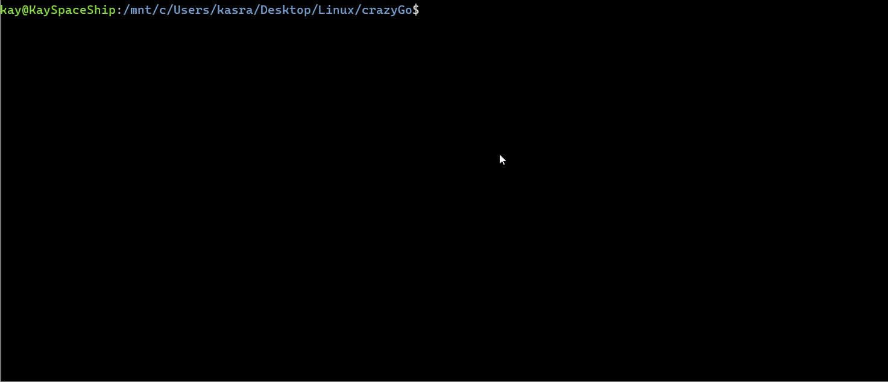

# aiterm

[](https://github.com/Thakay/aiterm/actions/workflows/ci.yml)
[](https://github.com/Thakay/aiterm/releases/latest)
[](https://goreportcard.com/report/github.com/Thakay/aiterm)
[](go.mod)
[](LICENSE)

`aiterm` translates natural language into shell commands, right in your terminal.
Describe what you want, review the command it suggests, then run it, copy it, edit it,
or refine it with a follow-up request. No more searching for that `find` or `tar`
incantation.

It is written in Go, ships as a single binary, and works with OpenAI or any
OpenAI compatible API, including local models served by Ollama or LM Studio.

<p align="center">
  
</p>

## Features

- **Natural language to commands**: describe the task, get a single command tailored
  to your OS (macOS BSD tools or Linux GNU tools).
- **You stay in control**: nothing runs until you press `y`. You can also copy the
  command, edit it before running, or exit. Replies that hide characters from the
  terminal are refused, and multi line commands are flagged before you confirm.
- **Follow-up requests**: refine the last answer with context ("now include hidden
  files") or start fresh without it.
- **Bring your own model**: pick any model with `-model`, including reasoning models,
  and point `-url` at any OpenAI compatible endpoint (Ollama, LM Studio, OpenRouter, ...).
- **Single static binary** for Linux and macOS on amd64 and arm64.

## Installation

### Prebuilt binaries

Download the archive for your platform from the
[latest release](https://github.com/Thakay/aiterm/releases/latest), extract it and put
`aiterm` on your `PATH`. For example:

```bash
# macOS on Apple silicon (use Darwin_x86_64 for Intel Macs)
curl -fsSL https://github.com/Thakay/aiterm/releases/latest/download/aiterm_Darwin_arm64.tar.gz | tar -xz aiterm
sudo mv aiterm /usr/local/bin/

# Linux on x86_64 (use Linux_arm64 for ARM)
curl -fsSL https://github.com/Thakay/aiterm/releases/latest/download/aiterm_Linux_x86_64.tar.gz | tar -xz aiterm
sudo mv aiterm /usr/local/bin/
```

To verify a download, fetch the archive and `checksums.txt` from the release, then run
`sha256sum --ignore-missing -c checksums.txt` (on macOS:
`shasum -a 256 --ignore-missing -c checksums.txt`).

The release archives include the `aiterm(1)` manual at
`docs/aiterm.1`. Install it in your system's `man1` directory to read it
with `man aiterm`.

### With Go

Requires Go 1.26 or newer. Go 1.21 and later download the right toolchain automatically.

```bash
go install github.com/Thakay/aiterm@latest
```

### From source

```bash
git clone https://github.com/Thakay/aiterm.git
cd aiterm
go build -o aiterm .
```

## Shell completions

Completion scripts for bash, zsh and fish live in `completions/` and are
included in the release archives. They complete the flag names; `-timeout`
also suggests a few durations. Everything after the flags is the request,
so there is nothing to complete there.

For bash, copy the script into your completion directory and start a new
shell:

```bash
sudo cp completions/aiterm.bash /etc/bash_completion.d/aiterm
```

On macOS with Homebrew the directory is `/usr/local/etc/bash_completion.d/`
(or `/opt/homebrew/etc/bash_completion.d/` on Apple silicon).

For zsh, copy the script as `_aiterm` into a directory on your `fpath`:

```bash
mkdir -p ~/.zsh/completions
cp completions/_aiterm ~/.zsh/completions/
autoload -Uz compinit && compinit
```

For fish, copy the script into your completions directory:

```bash
cp completions/aiterm.fish ~/.config/fish/completions/
```

## Configuration

`aiterm` needs an API key. Flags go before the request and take precedence over
environment variables.

| Flag       | Environment variable | Default                                      | Description                                           |
|------------|----------------------|----------------------------------------------|-------------------------------------------------------|
| `-key`     | `OPENAI_KEY`         |                                              | API key sent as a bearer token                        |
| `-model`   | `AITERM_MODEL`       | `gpt-4.1-mini`                               | Model used to generate commands                       |
| `-url`     | `AITERM_URL`         | `https://api.openai.com/v1/chat/completions` | Chat completions endpoint of an OpenAI compatible API |
| `-timeout` | `AITERM_TIMEOUT`     | `2m`                                         | How long to wait for the API, such as `30s` or `5m`   |
| `-version` |                      |                                              | Print the version and exit                            |

Prefer the environment variable over `-key`, so the key does not end up in your shell
history or the process list. Set it in your shell profile (`~/.zshrc`, `~/.bashrc`),
or enter it without echo for the current shell with `read -rs OPENAI_KEY && export OPENAI_KEY`.
If no key is set, or the key is rejected, `aiterm` asks for one (without echoing it)
and uses it for the current session.

### Local models with Ollama

```bash
export AITERM_URL="http://localhost:11434/v1/chat/completions"
export AITERM_MODEL="llama3.2"
export OPENAI_KEY="ollama"   # Ollama ignores the key, but aiterm expects one to be set
export AITERM_TIMEOUT="5m"   # optional: give slow local models more time
```

## Usage

The full command reference is in the [`aiterm(1)` manual page](docs/aiterm.1).

Pass your request as arguments. Quotes are optional for plain words, but your shell
expands the arguments before `aiterm` sees them, so quote the request if it contains
characters such as `*`, `?`, `&`, `|`, `;`, `<`, `>`, `#`, `$` or an apostrophe.
Single quotes are the safest choice.

```bash
aiterm "find all the files that contain the word foo in the parent directory"
aiterm show the 10 largest files in this folder
aiterm 'list *.log files older than 7 days'
```

`aiterm` shows the suggested command and a menu:

| Key | Action                                                              |
|-----|---------------------------------------------------------------------|
| `y` | Run the command (its output streams straight to your terminal)      |
| `c` | Copy the command to the clipboard and exit                          |
| `g` | Copy the command, then paste an edited version to run with `aiterm` |
| `r` | Send a follow-up request that keeps the conversation context        |
| `w` | Send a new request without the previous context                     |
| `q` | Quit                                                                |

If a command fails, or you stop it with Ctrl+C, `aiterm` prints the exit status and
brings the menu back so you can edit it or ask for another one.

On Linux, copying to the clipboard needs `xclip`, `xsel` or `wl-clipboard`. Without
one of them, `aiterm` prints the command so you can copy it yourself.

> [!WARNING]
> Commands come from a language model and can be wrong or destructive. Always read a
> command before you run it. `aiterm` refuses replies containing control or invisible
> characters (which could make the terminal show something other than what runs) and
> warns when a command spans several lines.

## Development

```bash
make test       # go test -race ./...
make lint       # golangci-lint run (https://golangci-lint.run)
make fuzz       # fuzz the model reply validation
make snapshot   # build the release archives locally with GoReleaser
```

The tests cover about 96% of the statements and never call a real API: they use a
scripted fake provider and an `httptest` server. Every pull request runs the tests on
Linux and macOS with the two supported Go releases, plus fuzzing, golangci-lint,
CodeQL, govulncheck and a GoReleaser snapshot build. Releases are built by
[GoReleaser](https://goreleaser.com) when a `v*` tag is pushed. See
[CONTRIBUTING.md](CONTRIBUTING.md) for details.

## Roadmap

- An explain option that describes what a command does before you run it ([#5](https://github.com/Thakay/aiterm/issues/5))
- Anthropic and Gemini models ([#6](https://github.com/Thakay/aiterm/issues/6))
- Windows support with PowerShell commands ([#7](https://github.com/Thakay/aiterm/issues/7))
- A Homebrew tap ([#8](https://github.com/Thakay/aiterm/issues/8))

Issues labeled [good first issue](https://github.com/Thakay/aiterm/labels/good%20first%20issue)
are a good place to start. Ideas and feedback are welcome in the
[issue tracker](https://github.com/Thakay/aiterm/issues).

## Contributing

Contributions are welcome! Please read [CONTRIBUTING.md](CONTRIBUTING.md) and our
[Code of Conduct](CODE_OF_CONDUCT.md) before opening a pull request. Report security
issues privately as described in [SECURITY.md](SECURITY.md).

## License

`aiterm` is licensed under the [MIT License](LICENSE).

## Contact

For questions and support, [open an issue](https://github.com/Thakay/aiterm/issues/new/choose).
